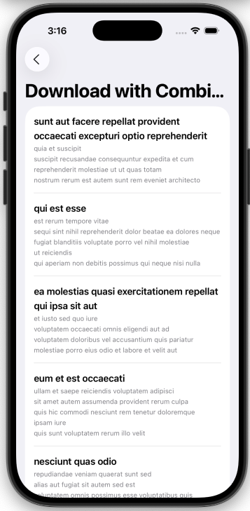
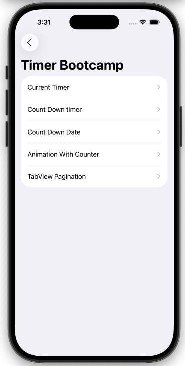
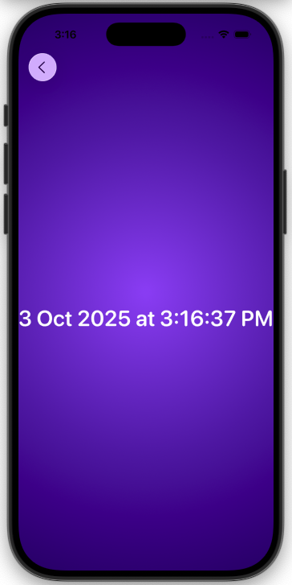
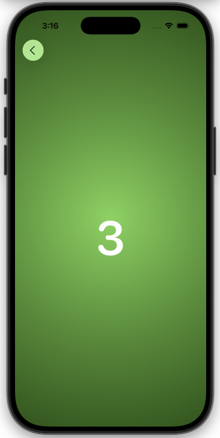
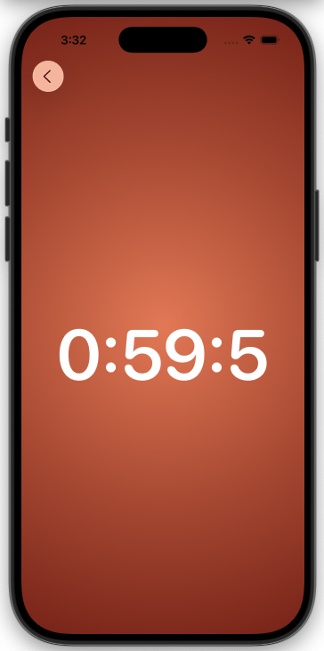
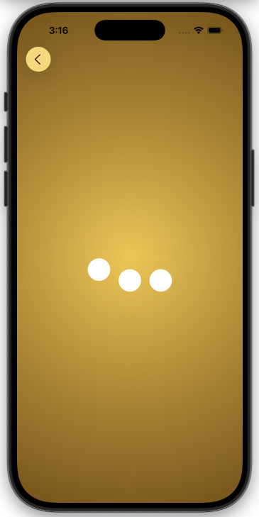
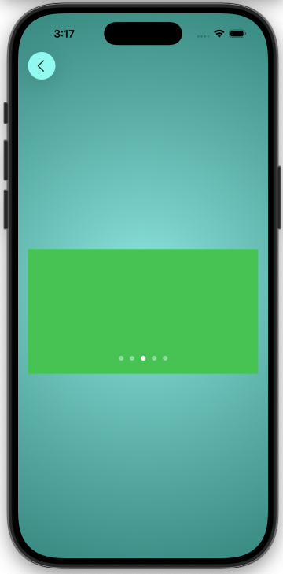
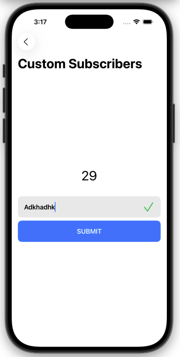

# SwiftUI + Combine Demo

## 📽 Demo Video

[🎬 Watch the Combine Demo](https://github.com/PareshKarnawat/CombineDemo/blob/main/Screenshots/CombineVideo.mov)

## 📸 Screenshots

  
  
  
  
  
  
  
  
  

